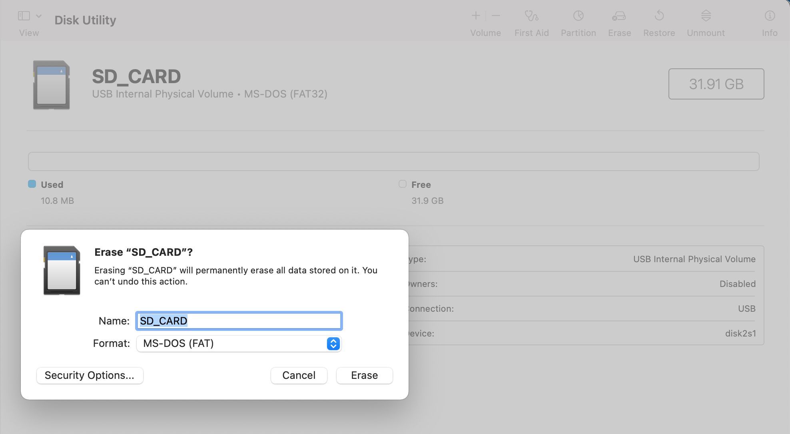
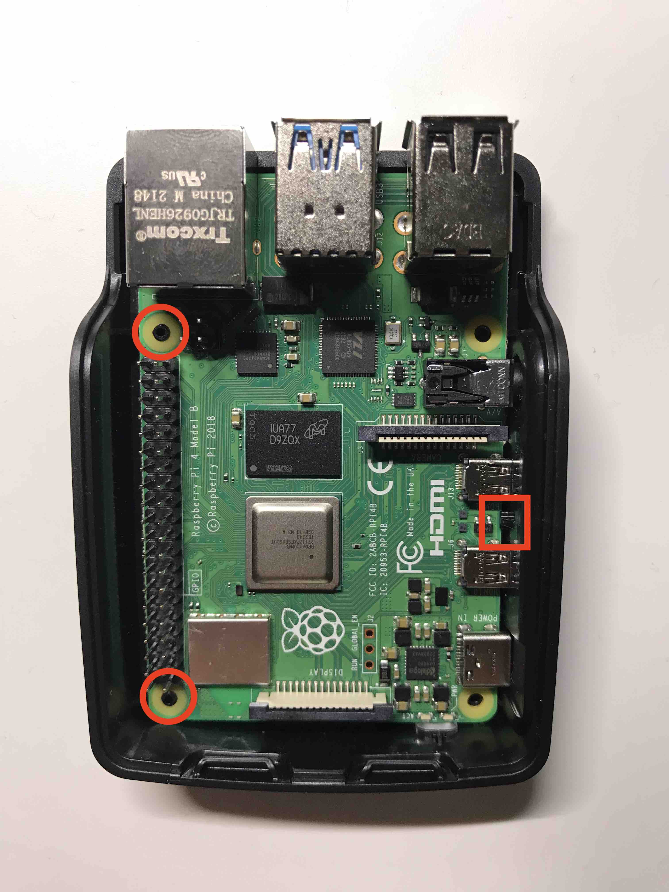

# Installing an OS on the Pi

## Using Raspberry Pi Imager
- Download and install the Imager app from `https://www.raspberrypi.com/software/`.
- Insert the micro SD card and follow the on-screen instructions. It simplifies things to ask the installation process to automatically configure the user name, password and WIFI connection.

## Using NOOBS

- Format the micro SD to `MS-DOS (FAT32)`. We did this using Disk Utility on a Mac. Click on the micro SD card and then select `Erase`.
    

- Download NOOBS, the full version, not the lite version, from `https://downloads.raspberrypi.org`. On my Mac, I uncompressed the downloaded file and saved the contents to the micro SD card in a terminal by using the command `unzip NOOBS_v3_8_1.zip -d path_to_sd_card`. On my machine, `path_to_sd_card` is `/Volumes/SD_CARD`.

- Put the Pi into the official case by first sliding it under the little tab between the two mini-HDMI ports (red square). Then pushing the Pi down firmly, so that the two studs at the bottom of the case (on the opposite side of the USB-C socket) slotted into the holes on either sides of the GPIO pins in the Pi (red circles). Our first attempt was unsuccessful because we were afraid of breaking the Pi and therefore did not push it down far enough. As a result we could not insert the micro SD!
    
 
- Insert the micro SD, connect the Pi to screen/mouse/keyboard, then plug it in. The lights on the Pi should start to flash and the screen should light up shortly afterwards. We set up the WIFI, and then installed *Raspberry Pi OS Full (32-bit) with desktop and recommended software*. The installation took less than 10 minutes. Then the Pi rebooted into the new OS automatically. We followed the on-screen instructions to choose a location and set up an account. Updating the OS took longer, but the process went smoothly, requiring no user input.

- In "Preferences (access via top-right raspberry icon) > Paspberry Pi Configuration". In the "System" tab, turn off "Auto Login".  Click "OK" to confirm. We then need to enter our password everytime we login, which seems to be more secure.