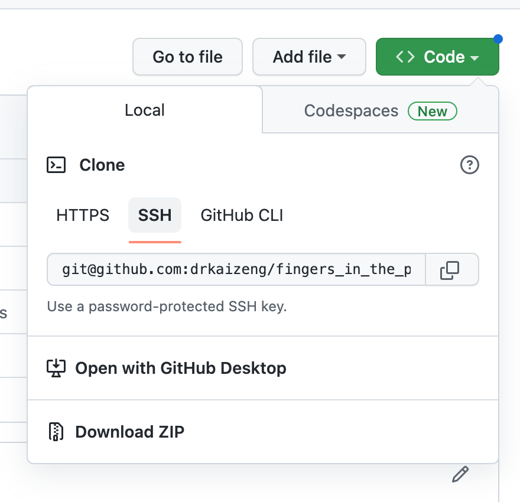

# Setting up python development tools


## Github setup
We use Github to store our code. To make it easier to push changes from the Pi to Github, on the Github account, in "Settings > SSH and GPG keys", add the Pi's public key. 

Create a repo on Github. On the repo's homepage, find the green button named "Code", and copy the contents of SSH into the clip board.


Open a terminal on the Pi, go to a desired location, and issue `git clone contents_in_clipboard`. If `git` has not been installed on, do `sudo apt-get install git` first.


## Creating a virtualenv `venv`
Our version of Raspberry Pi OS comes with `python 3.9.2`, which is sufficient for our purpose. However, it is good practice to use a local environment for each project, so that different projects do not clash with one another. 

Go the to project's folder. The following creates a new environment in a local folder named `venv`.
```
python -m venv --copies --clear ./venv
```

To activate the environment, use
```
source ./venv/bin/activate
```

The name `venv` should appear in the command prompt, indicating that the environment has been activate. New packages can now be installed using `pip`.

Use `deactivate` to exit the environment.

We do not want git to keep track of the files in `.venv`. To this end, at the top level of the project's folder, create a new file named `.gitignore` and add `.venv/` in it.


## VS Code setup
We will primarily be doing remote development using VS Code. Use the [Remote Explorer](vscode_setup.md) to open the folder created in the previous step by `git clone`. This folder will appear in the Remote Explorer, so that we can simply click on it to open.

Click on the Extensions icon and install the Python extension pack in VS Code. The Black Formatter extension could also be installed to help automatical code formatting. Then open the Command Palette, type `Python: Select Interpreter` > "+ Enter interpreter path...". In the window, find the folder that contains the `venv` folder, and within it, locate `bin/python`.


## Readthedocs setup
We would like to use Markdown to document our progress. Readthedocs (https://readthedocs.org/) provides free hosting services. Their website provides a fairly detailed description about how to link a Github account with a Readthedocs account, how to import data from Github, and how to enable writing documentation using Markdown with `mkdocs`. In what follows, we outline the main steps and describe things that have tripped us up.

- It is quite useful to be able to write, build and view documentations locally. To this end, go to the project's folder, and activate the `venv` using the steps described above. Issue `pip install mkdocs` to add the tool into the `venv`. Then while at the top level of the project's folder, use `mkdocs new .` to create a Markdown documentation set-up. This will add a folder `docs` and `mkdocs.yml` to the project. In `docs`, we will find `index.md`. This is the total level entry point for our documentation.

- Once we have written some documentation, we can use `mkdocs serve`. This will compile the Markdown code and open a web browser, so that we can see the results.

- Go to `https://readthedocs.org/` and follow the tutorial on setting up an account and importing projects from Github. 
  On "Project Details" page, check "Edit advanced project options" before clicking on "Next". On the next page, change "Documentation type" to "Mkdocs". 
  
- After the project has been imported, click on the "Admin" button. The go to "Adavanced settings", and check "Build pull requests for this project".

With these set-ups, everytime we push changes from the Pi to Github, the changes will also trickle down to Readthedocs, and trigger a new build of the documentation.

It is a good idea to pin some of the key libraries `mkdocs` uses (including itself); this reduces the risk of compatibility problems caused by library upgrades. See `.readthedocs.yaml` and `docs/requirements.txt` in the Github repo.

***Note***: If you want to see the updated documentation build, click on the large green View Docs button on the project's homepage on Readthedocs. However, make sure you refresh your web browser. Otherwise the browser would probably just load what it has put into the cache, instead of the up-to-date build. We spent a long time trying to figure why a successful Readthedocs build did not result in the website being updated, only to find out that, by merely copying and pasting the web link into the browser, we had been just looking at the browser's cached version.