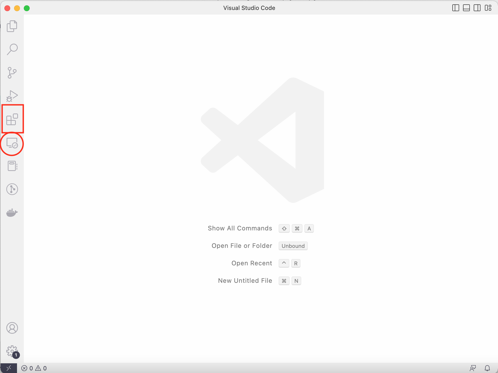
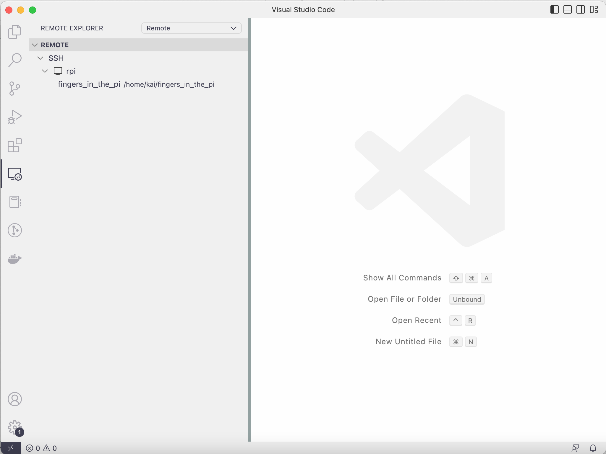

# Using VS Code for remote development
- Install VS Code (https://code.visualstudio.com/) on the non-Pi machine

- Click on the Extensions button (red square). Install the Remote Development extension pack. Afterwards, the "Remote Explorer" icon should appear (red circle).
    

- If you add the Pi to `.ssh/config` when [setting up SSH connection](ssh_setup.md), then when clicking on the "Remote Explorer" icon, rpi (or the hostname you have used) should appear. 
    


- If the Pi does not turn up in the "Remote Explorer", then open the Command Palette (command + shift + p on Mac) and type `Remote-SSH: Connect to Host` > `Configure SSH Hosts`, then select the `config` file in the `.ssh` folder in your home directory. Add something similar to the following to the file:
  ```
  Host rpi
    AddKeysToAgent yes
    UseKeychain yes
    IdentityFile ~/.ssh/id_ed25519
    User your_pi_user_name
  ```
  
- In the Remote Explorer, click on the open folder icon to the right of `rpi` to open a folder on the Pi. VS Code will remember this folder has been opened before. So next time when we click on the Remote Development icon, we will see a list of folders that we have worked on before.

***Note***: If an SSH key pair is also set up on the Pi, then after each reboot, or on each new log in, `keychain` requires us to enter the SSH passphrase (for the Pi, not the non-Pi machine). VS Code does not seem to allow us to do this. The work-around is to open a terminal and log on to the Pi there. Once the connection is authenticated, VS Code should be able to connect to the Pi again.

  

