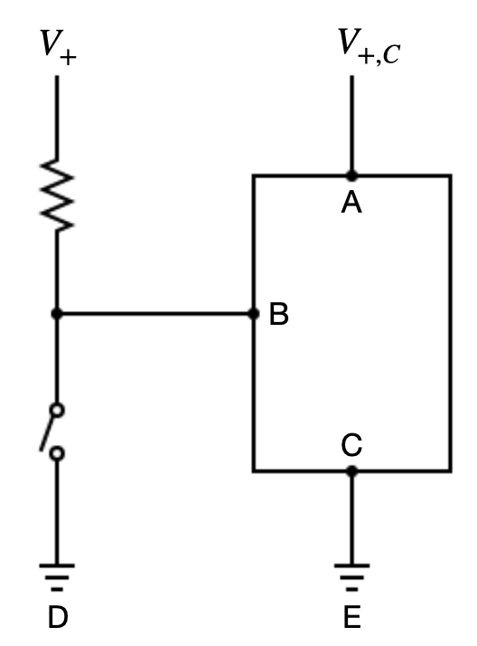
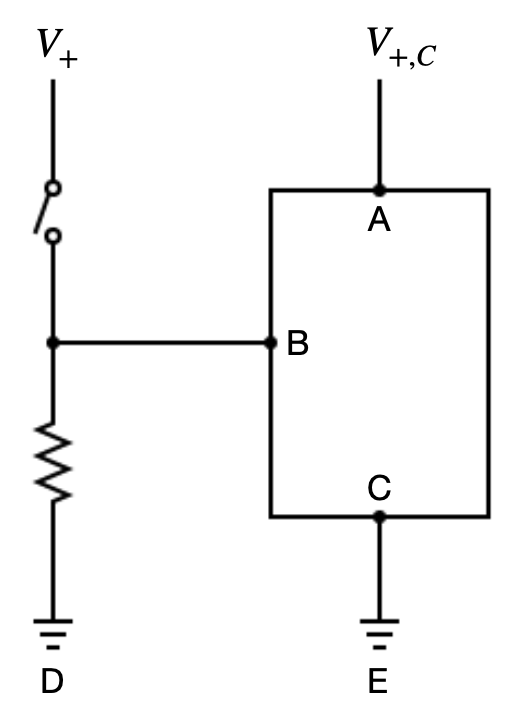

# Home-made keyboard

In this project, we want to learn how to get the Pi to take inputs from push buttons.

## Electronics basics
When looking into writing code to respond to push button signals, two unfamiliar terms kept popping up: pull-up and pull-down. So we spent sometime trying to understand the basics, just so that we wouldn't blow up the Pi :-). The following is what we have found.

### The state of a digital logic gate (pin)
When a GPIO pin is connected to a push button, we are effectively using the pin as a digital logic gate. A logic gate has two state: high and low. If the voltage from the pin of the chip to the chip's ground is below $V_L$, then the pin's state is regarded as low. If the input voltage is above $V_H$, then its state is regarded as high. Obviously, $0 < V_L < V_H < V_\text{MAX}$. The interval $(V_L, V_H)$ is known as the indeterminate region, in which the state of the pin is neither high nor low. The purpose of pull-up/pull-down resisitors are to tie the state of the pin to high/low, by, e.g., preventing accidental switching of state due to interference. They also control the current flow and prevent short circuit.

### Pull-up resistors
If we want high as the default state of the pin and want to change the state to low by pushing the button, we use pull-up resistors, as shown below. When the switch is open (off), there is a high voltage from B to C, leaving the pin in the high state. When the switch is closed (on), the current, after passing the pull-up resistor, flows directly to ground (D), because $R_{BC}$ the impedance of the chip is typically very high. Thus, the pin is connected to ground (0V) and assumes the low state.

Note that if the pull-up resistor is removed, when the switch is closed, there is a direct short circuit between $V_+$ and ground, which creates excessive current flow and may damage the circuit.

Note that the job of the chip is to measure the voltage from the input pin B to the chip's ground C. When the swich is open, the current flows from $V_+$ to B and to C. There is resistance between B and C, denoted by $R_{BC}$. The minimum input current for pin B that is required for the chip to work is denoted by $I_\text{IN}$. The voltage drops as the current flows through the pull-up resistor. We need to make sure that the remaining voltage is at least $V_H$ so that the pin is in the high state. Thus, the maximum allowable resistance is
$$
R_\text{MAX,Pull-up} \le \frac{V_+ - V_H}{I_\text{IN}}
$$

where $I_\text{IH(MAX)}$ is the maximum sink current (the ability of the port to receive current). Normally resistors with lower resistance are used because we want to guarantee that the state of the pin is high after the input current passing through the pull-up resistor.

### Pull-down resistors
Recall that the chip's job is to measure the voltage from the input pin B to its ground C. When the switch is open, B is effectively connected to ground. So there is a low voltage from B to C. When the swtich is closed, then B has voltage $V_+$ and the pin is in the high state. 

Note that if we remove the section that includes D (ground) and the pull-down resistor, then when the switch is open, the input pin becomes analogous to an antenna, liable to picking up electrical signals generated by external sources or the chip itself. The pin is in a floating state, and could fluctuate between high and low.

To calculate the maximum allowable resistance value for the pull-down resistor, note that, when the switch is open, current flows from $V_{+,C}$ to A to B and finally to D. As the current flows from A to B, there will be a voltage drop due to resistance, denoted by $R_{AB}$. Let the maximum current sourcing ability (i.e., the maximum current flowing out of the pin) be $I_\text{OUT}$. Because we have two resistors in series, and because D is ground with voltage 0, the total voltage drop is $V_{+,C}$. We need to ensure that after the drop caused by $R_{AB}$, the remaining voltage is lower than $V_L$, to ensure that when the switch is open, the input pin is in the low state. Thus, the maximum resistance value of the pull-down resistor $R_\text{MAX,Pull-down}$ must satisfy 
$$
R_\text{MAX,Pull-down}  \le \frac{V_L}{I_\text{OUT}}
$$