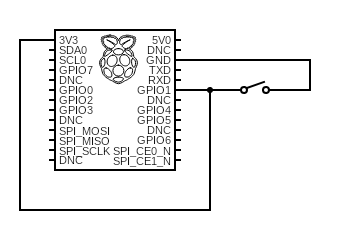
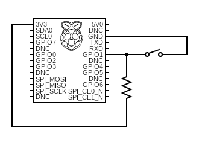

# Home-made keyboard

In this project, we want to learn how to get the Pi to take inputs from push buttons.

## Electronics basics
When looking into writing code to respond to push button signals, two unfamiliar terms kept popping up: pull-up and pull-down. So we spent sometime trying to understand the basics, just so that we wouldn't blow up the Pi :-). The following is what we have found.

### The state of a digital logic gate (pin)
When a GPIO pin is connected to a push button, we are effectively using the pin as a digital logic gate. A logic gate has two state: high and low. If the input voltage is below $V_\text{IL(MAX)}$, then the pin's state is regarded as low. If the input voltage is above $V_\text{IH(MIN)}$, then its state is regarded as high. Obviously, $0 < V_\text{IL(MAX)} < V_{\text{IH(MIN)}} < V_\text{IH(MAX)}$. The interval $(V_\text{IL(MAX)}, V_\text{IH(MIN)})$ is known as the indeterminate region, in which the state of the pin is neither high nor low. The purpose of pull-up/pull-down resisitors are to tie the state of the pin to high/low, by, e.g., preventing accidental switching of state due to interference. They also control the current flow and prevent short circuit.

### Pull-up resistors
If we want high as the default state of the pin and want to change the state to low by pushing the button. A naive way of achieving this is depicted below, assuming, for illustration's sake, that the Pi's GPIO pins have no built-in pull-up resistors:

When the switch is open (off), the input voltage for GPIO1 is 3.3V, corresponding to the high state. When the switch is closed (on), the pin is collected to ground and assumes the low state. Unfortunately, when the switch is on, there will be a direct short circuit between the 3.3V supply and ground, resulting in excessive current flow, which may damage the circuit.

Adding a (pull-up) resistor avoids shorting out the supply:

Here it is important to consider the maximum pull-up resistance. In the circuit above, GPIO1 can be thought of as a path connected to ground. Thus, current flows into the pin. The addition of the pull-up resistor means a drop in voltage as the current flows past it. We need to ensure that the drop in voltage is not greater than $V_\text{CC} - V_\text{IH(MIN)}$, where $V_\text{CC}$ is the voltage of the power supply, which is 3.3V in our case. Thus, the maximum allowable resistance is
$$
R_\text{MAX} = \frac{V_\text{CC} - V_\text{IH(MIN)}}{I_\text{IH(MAX)}}
$$

where $I_\text{IH(MAX)}$ is the maximum sink current (the ability of the port to receive current). Normally resistors with lower resistance are used because we want to guarantee that the state of the pin is high after the input current passing through the pull-up resistor.
