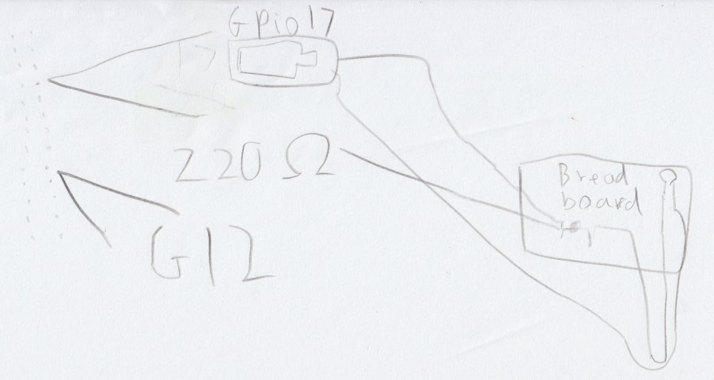

# LED light show
In this project, we want to wire up multiple LED lights and make them dance to the version of Head, Shoulders, Knees and Toes created by Cocomelon (`https://www.youtube.com/watch?v=QA48wTGbU7A&t=122s`).


## Installing additional tools
We need an MP3 player to play the music. Here we use `mpg123`, which can be installed using:
```
sudo apt-get install mpg123
```

We also need the following packages to the python virtualenv to control the LEDs:
```
pip install rpi.gpio pigpio gpiozero
```


## Running the program
We need to do the following first:
- Wire up 3 LED lights (see [below](#connecting-leds-to-the-pi)).
- An MP3 file containing the song. There are website for converting Youtube videos to MP3s.
- Connect speakers to the Pi. Note that the Pi may direct its audio output to the HDMI device (if connected). If the 3.5mm headphone jack is to be used, enter `sudo raspi-config` in a terminal. In `System Options` > `Audio`, choose 3.5mm jack.

Once the above is done, we can set up a brand new Python virtualenv using the following steps, assuming that `python 3.9.2` has been installed (consider using `pyenv` to switch between different Python versions):
```
git clone git@github.com:drkaizeng/fingers_in_the_pi.git
git checkout 6a4bd62431a757ec8d81940cca79b903ca9b1c3e
python -m venv --copies --clear ./venv
source venv/bin/activate
pip install -r requirements.txt
export PYTHONPATH=path_to_src_folder  # This is the src folder inside the repo
python -m led_light_show.led_light_show --led-gpio-ids 17 9 5 --path-to-mp3=path_to_mp3  # Replace the GPIO numbers with the pins used
```

## Connecting LEDs to the Pi
There are many instructions on the internet about how to wire up LEDs. Here we only show two circuit diagrams, both made by Jim, one by hand, and other using a free online circuit diagram maker :-)

<center></center>
