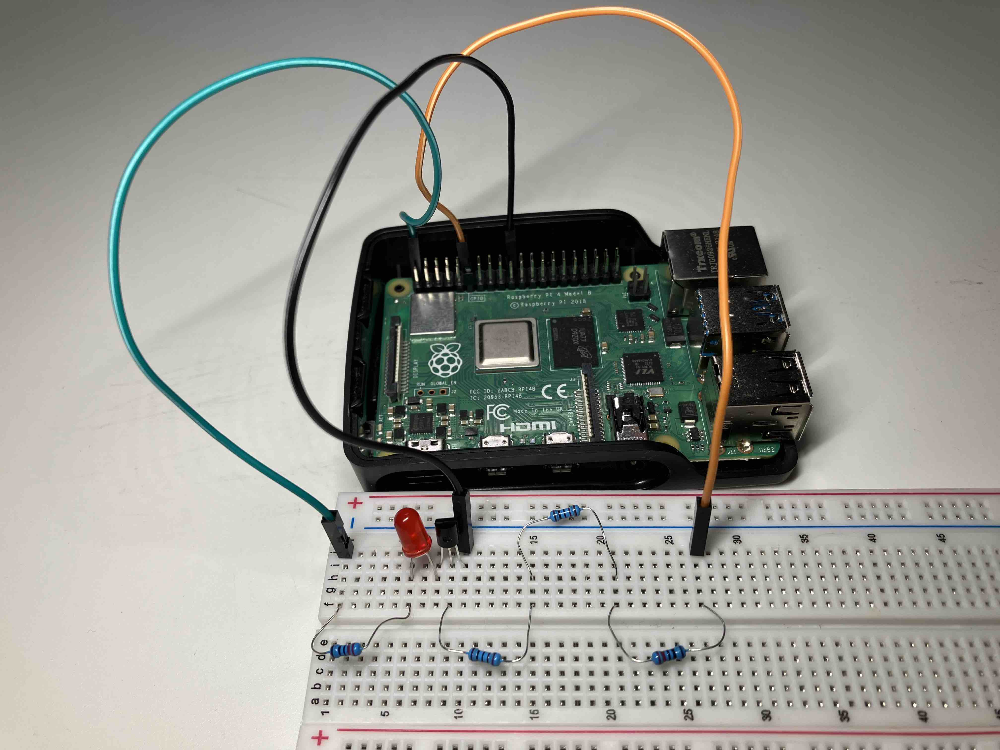
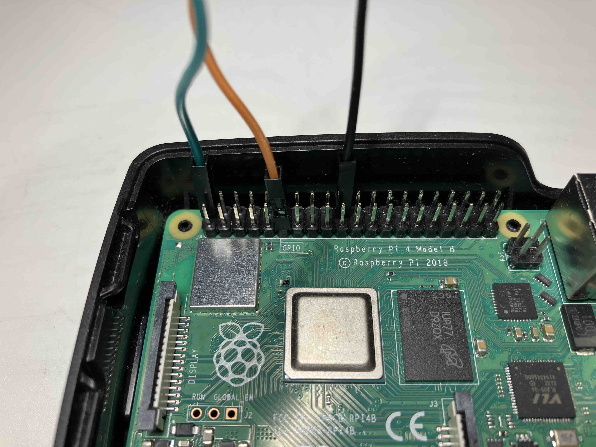

# NPN transitors as switches and memory-based GPIO control

This project is based on the following sections in *Molloy - Exploring Raspberry Pi* (hereafter referred to as the Book):
- LED: pp. 128 - 129
- Transistors: pp. 132 - 138
- Fig. 6-2(b) on p. 223
- Memory-based GPIO control: pp. 245 - 252

## The circuit
A S8050 NPN transistor was used in a circuit similar to Fig. 6-2(b). The base resistor value was determined by using the equation on p. 135 of the Book
$$
R_{base} = \frac{V_B - V_{BE(sat)}}{2 \times (I_C \div h_{FE(min)})}
$$
For this curcuit, $V_B = 3.3\text{V}$. $I_C$ is approximately 5V (the output of pin 2) divided by 220$\Omega$ (LED has little resistance; see p. 129 of the Book), which comes out as 0.023A. This is well within the power rating of the pins (see [here](./useful_info.md#the-power-rating-of-the-pins)). From p. 2 of S8050's dataset, $h_{FE(min)} = 40$. Using the 4th figure on p. 3 of S8050's dataset, $V_{BE(sat)}$ is approximately 0.8V. Thus, $R_{base}=2173.91\Omega$. Thus, two 1K $\Omega$ resistors and one 220 $\Omega$ were used.
{:style="height:600px"}
{:style="height:600px"}

## Controlling the LED
V4 of the Pi no longer supports `sysfs` described in the Book.

### Using `pinctrl`
```bash
# Turning the LED on, by setting GPIO 17 to output high 
pinctrl set 17 op dh

# Turning the LED off, by setting GPIO 17 to be an output zero/low
pinctrl set 17 op dl
```

### By accessing the registers directly.
The following code is based on Listing 6-9 in the Book, but with the following changes:
- The rpi 4's registers are used.
- The LED is made to blink before the program terminates.

Useful details can be found in the comments.
```C
// compile using: gcc LEDflash.c -o LEDflash
// execute using: sudo ./LEDflash

#include <stdio.h>
#include <stdlib.h>
#include <fcntl.h>
#include <errno.h>
#include <sys/mman.h>
#include <stdint.h>   // for uint32_t - 32-bit unsigned integer
#include <unistd.h>   // getuid
#include <string.h>   // strerror

#define GPIO_BASE    0xFE200000   // The returned value of `sudo cat /proc/iomem | grep gpio -i`
#define GPSET0       0x1c         // BCM2711 datasheet p. 66; BCM2835 datasheet p. 90
#define GPCLR0       0x28         // BCM2711 datasheet p. 66; BCM2835 datasheet p. 90
#define GPLVL0       0x34         // GPLEV0 on BCM2711 p. 66; BCM2835 p. 90
static volatile uint32_t* gpio;   // pointer to the gpio (*int)

int main() {
    int fd, x;
    printf("Start of GPIO memory-manipulation test program.\n");
    if (getuid() != 0) {
       printf("You must run this program as root. Exiting.\n");
       return -EPERM;
    }
    if ((fd = open("/dev/mem", O_RDWR | O_SYNC)) < 0) {
       printf("Unable to open /dev/mem: %s\n", strerror(errno));
       return -EBUSY;
    }
    // get a pointer that points to the peripheral base for the GPIOs
    // All accesses are assumed to be 32-bit (BCM2711 p. 66)
    gpio = (uint32_t *) mmap(0, getpagesize(), PROT_READ | PROT_WRITE,
       MAP_SHARED, fd, GPIO_BASE);
    // On error, the value MAP_FAILED (that is, (void *) -1) is returned, and errno is set to indicate the error.
    if (gpio == (void *) -1) {
       printf("Memory mapping failed: %s\n", strerror(errno));
       return -EBUSY;
    }
    // at this point gpio points to the GPIO peripheral base address
    // set up the LED GPIO FSEL17 mode = 001 at addr GPFSEL1 (0004)
    // From the GPFSEL1 Register Table on p. 67 of BCM2711, 001 means the pin is an output
    // gpio points to uint32. Thus, moving one step is equivalent to 
    // moving 4 bytes, which is the offset for GPFSEL1
    // writing NOT 7 (i.e., ~111) clears bits 21, 22 and 23.
    *(gpio + 1) = (*(gpio + 1) & ~(7 << 21) | (1 << 21));
 
    // turn the LED on using the bit 17 on the GPSET0 register
    for (int idx = 0; idx < 10; idx++) {
        // Each move of the gpio pointer is equivalent to jumping 4 bytes. Thus divide the offset by 4.
        *(gpio + (GPSET0 / 4)) = 1 << 17;
        usleep(500000);          // cannot use sleep as it is non-blocking
        *(gpio + (GPCLR0 / 4)) = 1 << 17;  // turn the LED off
        usleep(500000);          // cannot use sleep as it is non-blocking
    }
 
    close(fd);
    return 0;
}
```